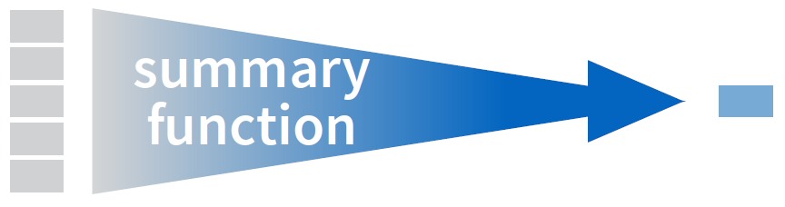

## Generating New Data
## Generating New Data

We often want to calculate new variables based upon existing ones

Or perhaps make changes to ones we have

We can use <span class="func">mutate</span> or <span class="func">transmute</span> for this

>- <span class='func'>mutate</span> appends to current data
>- <span class='func'>mutate_all</span> will apply a function over multiple columns
>- <span class='func'>mutate_if</span> will apply under some condition
>- <span class='func'>mutate_at</span> will apply to specific columns
>- <span class='func'>transmute</span> will return only the newly created data

First, let's scrape some data:

```{r basketballDataScrape, cache=TRUE, message=FALSE, echo=-1}
library(rvest); 
url = "http://www.basketball-reference.com/leagues/NBA_2015_totals.html"
bball = read_html(url) %>% 
  html_nodes("#totals_stats") %>% 
  html_table %>% 
  data.frame %>%
  filter(Rk != "Rk")
```


## Generating New Data
The data is currently all character strings.

We'll use <span class='func'>mutate_all</span> to make every column numeric except for Player, Pos, and Tm.

```{r mutateEach, cache=TRUE}
glimpse(bball[,1:5])

bball %<>% 
  mutate_at(funs(as.numeric), .cols=vars(-Player, -Pos, -Tm))   

glimpse(bball[,1:5])
```


## Mutate
<div class="columns-2">
<span class='func'>mutate</span> takes a vector and returns a vector of the same dimension

- 'window' function

<br>
We will contrast it with <span class='func'>summarize</span> later

- or <span class='func'>summarise</span> if you prefer
<br>
<br>
<br>
<br>


</img>
</img>
</div>


## Generating New Data

A common task- creating composites of existing variables

```{r mutate, cache=TRUE}
bball = bball %>% 
  mutate(trueShooting = PTS / (2 * (FGA + (.44 * FTA))),
         effectiveFG = (FG + (.5 * X3P)) / FGA, 
         shootingDif = trueShooting - FG.)

summary(select(bball, shootingDif))  # select and others don't have to be piped to use
```


## Generating New Data

Note how we use the new variables

We can use them without quotes

We can use use any variable as soon as it's created


## Generating New Data

Sometimes we want to combine (or split) variables...

<span class='func'>unite</span> creates a string combination of others

- essentially <span class='func'>paste</span>

```{r tidyrUnite, cache=TRUE}
library(tidyr)
bball %>% 
  unite("posTeam", Pos, Tm) %>% 
  select(1:5) %>% 
  head
```


## Generating New Data

<span class='func'>separate</span> does the opposite

Separate player into first and last names based on the space

```{r tidyrSpread, cache=TRUE}
bball %>% 
  separate(Player, into=c('firstName', 'lastName'), sep=' ') %>% 
  select(1:5) %>% 
  head
```

## Your turn
## Your turn

Data: state.x77

0. Convert to <span class='func'>data.frame</span>
1. Create a variable that's the <span class='func'>log</span> of population (<span class='func'>mutate</span> )
2. Create <span class="objclass">curLifeExp</span> as Life Expectancy (<span class="objclass">Life.Exp</span>) + 5 (<span class='func'>mutate</span> )
3. summarize the data (<span class='func'>summary</span> )

## Example
```{r yourTurnMutateExample, cache=TRUE}
state.x77 %>% 
  data.frame %>% 
  mutate(popLog = log(Population),
         curLifeExp = Life.Exp+5) %>% 
  summary
```
