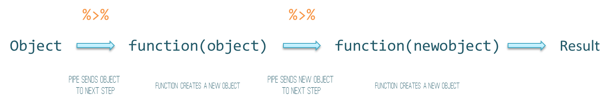

## Newer approaches to data wrangling

Let's say we want to select the following from our data:

  - Start with the **ID** variable
  - The variables **X1:X10**, which are not all together, not the only X* variables
  - The variables **var1** and **var2**, which are the only *var* variables in the data
  - Any variable that starts with **XYZ**
    
How might we go about this?


## Some base R approaches

Typically tedious

Multiple steps just to get the columns you want

```{r baseRexample1, eval=FALSE}
# numeric indexes; not conducive to readibility or reproducibility
newData = oldData[,c(1,2,3,4, etc.)]

# explicitly by name; fine if only a handful; not pretty
newData = oldData[,c('ID','X1', 'X2', etc.)]

# two step with grep; regex difficult to read/understand
cols = c('ID', paste0('X', 1:10), 'var1', 'var2', grep(colnames(oldData), '^XYZ', value=T))
newData = oldData[,cols]

# or via subset
newData = subset(oldData, select = cols)
```


## More

What if you also want observations where **Z** is **Yes**, Q is **No**
ordered by **var1** (descending)...
and only the last 50 of those results?

```{r baseRexample2, eval=FALSE}
# three operations and overwriting or creating new objects if we want clarity
newData = newData[oldData$Z == 'Yes' & oldData$Q == 'No',]
newData = tail(newData, 50)
newData = newdata[order(newdata$var1, decreasing=T),]
```

And this is for fairly straightforward operations.


## An alternative

```{r pipeExample, eval=FALSE}
newData = oldData %>% 
  filter(Z == 'Yes', Q == 'No') %>% 
  select(num_range('X', 1:10), contains('var'), starts_with('XYZ')) %>% 
  arrange(desc(var1)) %>% 
  tail(50)
```


## An alternative


Piping is an *alternative*

You can do all this sort of stuff with base R

- <span class="func">with</span>, <span class="func">within</span>, <span class="func">subset</span>, <span class="func">$</span>, etc.

While the base R approach can be concise, it is potentially: 

>- noisier
>- less legible
>- less amenable to additional data changes
>- requires esoteric knowledge (e.g. regular expressions)
>- often requires new objects (even if we just want to explore)

## Piping

<span class='pipe'>%>%</span> : Passes the prior object to the function after the pipe

- x <span class='pipe'>%>%</span> f same as f(x)

```{r eval=FALSE}
object %>% function(object)
```

## Piping



## Another example...

## Start with a string, end with a map

```{r wikileafletNoEval, eval=FALSE}
wikiURL = 'https://en.wikipedia.org/wiki/List_of_United_States_cities_by_population'

# Let's go!
wikiURL %>% 
  read_html() %>%                                                                   # parse the html
  html_node(css='.wikitable.sortable') %>%                                          # grab a class of object
  html_table() %>%                                                                  # convert table to data.frame
  sapply(function(x) repair_encoding(as.character(x), 'UTF-8')) %>%                 # repair encoding; makes a matrix
  data.frame() %>%                                                                  # back to df
  mutate(City = str_replace(City, '\\[(.*?)\\]', ''),                               # remove footnotes
         latlon = sapply(str_split(Location, '/'), last),                           # split up location (3 parts)
         latlon = str_extract_all(latlon, '[-|[0-9]]+\\.[0-9]+'),                   # grab any that start with - or number
         lat = sapply(latlon, first),                                               # grab latitudes
         lon = sapply(latlon, nth, 2),                                              # grab longitude
         population2015 = as.numeric(str_replace_all(X2015.estimate, ',', '')),     # remove commas from numbers (why do people do this?)
         population2010 = as.numeric(str_replace_all(X2010.Census, ',', '')),       # same for 2010
         popDiff  = round(population2015/population2010 - 1, 2)*100) %>%            # create percentage difference
```


## Cont'd.

```{r wikileafletNoEval2, eval=FALSE}
  select(-latlon, -Location) %>%                                                    # remove stuff we wouldn't ever use
  filter(as.numeric(as.character(X2015.rank)) <= 50)  %>%                           # top 50
  plot_geo(locationmode = 'USA-states', sizes = c(1, 250)) %>%                      # map with plotly
  add_markers(x = ~lon, y = ~lat, size = ~abs(popDiff), hoverinfo='text', 
              color=~popDiff, hoverinfo='text', colors='RdBu',
              text=~hovertext, marker = list(opacity = 0.5)) %>%  
  layout(title = 'Largest US cities and their 2010-2015 change', 
         geo = g, paper_bgcolor='#fdf6e3')

# g is a list of map options, e.g. projection line colors etc.
```


## And the result...

```{r wikileaflet, eval=F, echo=FALSE}
library(rvest); library(stringr); library(leaflet)

'https://en.wikipedia.org/wiki/List_of_United_States_cities_by_population' %>% 
  read_html %>% 
  html_node(css='.wikitable.sortable') %>% 
  html_table %>% 
  sapply(function(x) repair_encoding(as.character(x), 'UTF-8'), simplify=F) %>%
  data.frame %>%  
  mutate(City = str_replace(City, '\\[(.*?)\\]', ''),
         latlon = sapply(str_split(Location, '/'), last), 
         latlon = str_extract_all(latlon, '[-|[0-9]]+\\.[0-9]+'), 
         lat = sapply(latlon, first),
         lon = sapply(latlon, nth, 2), 
         population2015 = as.numeric(str_replace_all(X2015.estimate, ',', '')),
         population2010 = as.numeric(str_replace_all(X2010.Census, ',', '')),
         popDiff  = round(population2015/population2010 - 1, 2)*100) %T>% 
  select(-latlon, -Location) %>% 
  filter(as.numeric(as.character(X2015.rank)) <= 50)  %>% 
  leaflet %>% 
  addProviderTiles("CartoDB.DarkMatterNoLabels") %>% 
  setView(-94, 35, zoom = 4) %>% 
  addCircleMarkers(~lon, ~lat,
                   radius=  ~scales::rescale(popDiff, c(2, 11)),
                   fillColor=  ~colorNumeric(palette = c('Red', 'White', 'Navy'), popDiff)(popDiff), 
                   stroke = FALSE, fillOpacity = .85,
                   popup=  ~paste(City, paste0(popDiff, '%')))
```

```{r plotlyMap, echo=FALSE}
library(rvest); library(stringr); library(plotly)
g <- list(
  scope = 'usa',
  projection = list(type = 'albers usa'),
  showland = TRUE,
  landcolor = toRGB("gray90"),
  showlakes=F,
  oceancolor= toRGB('red'),
  subunitwidth = 1,
  countrywidth = 1,
  subunitcolor = toRGB('#fdf6e3'),
  countrycolor = toRGB('#fdf6e3'),
  bgcolor = toRGB('#fdf6e3')
)

'https://en.wikipedia.org/wiki/List_of_United_States_cities_by_population' %>% 
  read_html %>% 
  html_node(css='.wikitable.sortable') %>% 
  html_table %>% 
  sapply(function(x) repair_encoding(as.character(x), 'UTF-8'), simplify=F) %>%
  data.frame %>%  
  mutate(City = str_replace(City, '\\[(.*?)\\]', ''),
         latlon = sapply(str_split(Location, '/'), last), 
         latlon = str_extract_all(latlon, '[-|[0-9]]+\\.[0-9]+'), 
         lat = sapply(latlon, first),
         lon = sapply(latlon, nth, 2), 
         population2015 = as.numeric(str_replace_all(X2015.estimate, ',', '')),
         population2010 = as.numeric(str_replace_all(X2010.Census, ',', '')),
         popDiff  = round(population2015/population2010 - 1, 2)*100,
         hovertext = paste(City, "<br />", paste0(popDiff, '%'))) %T>% 
  select(-latlon, -Location) %>% 
  filter(as.numeric(as.character(X2015.rank)) <= 50)  %>% 
  plot_geo(locationmode = 'USA-states', sizes = c(1, 250)) %>%
  add_markers(x = ~lon, y = ~lat, size = ~abs(popDiff), hoverinfo='text', color=~popDiff, hoverinfo='text', colors='RdBu',
              text=~hovertext, marker = list(opacity = 0.5)) %>%  
  layout(title = 'Largest US cities and their 2010-2015 population change', 
         geo = g, paper_bgcolor='#fdf6e3')

```

## 

For your own code, try a more concise approach

- Better to do the parsed page, data stuff, and plot as separate steps


However, it serves as an illustration of what's possible

>- Key commands: <span class="func">mutate</span>, <span class="func">select</span>, <span class="func">filter</span>
>- Autocomplete for unquoted variable names
>- Pipe to other functions (e.g. visualization)


## Newer approaches to data wrangling

Packages have been created to make data wrangling easier

We will focus on <span class='pack'>plyr</span>, <span class='pack'>dplyr</span>, and <span class='pack'>tidyr</span>

But others, e.g. <span class='pack'>data.table</span>, may be useful as well

Newer visualization packages work similarly

- Makes it easier to explore your data visually


## A provocation
<div style='font-size:150%'>
```{r provocation1, eval=F, echo=T}
c('Ceci', "n'est", 'pas', 'une', 'pipe!') %>%
{
  .. <-  . %>%
    if (length(.) == 1)  .
    else paste(.[1], '%>%', ..(.[-1]))
  ..(.)
} 
```
</div>


##

<div style='font-size:150%'>
```{r provocation2, eval=T, echo=T}
c('Ceci', "n'est", 'pas', 'une', 'pipe!') %>%
{
  .. <-  . %>%
    if (length(.) == 1)  .
    else paste(.[1], '%>%', ..(.[-1]))
  ..(.)
} 
```
</div>


## Your turn...
## Your turn
Let's get to it!

>- Use a base R dataset
    - Examples: iris, mtcars, faithful or state.x77; <span style='font-family:monospace'>library(help='datasets')</span>
>- Pipe to something like the <span class='func'>summary</span>, <span class='func'>plot</span> or <span class='func'>cor</span> (if all numeric) as follows:

```{r yourturnPipe, eval=FALSE}
data %>% 
  function
```

>- Use additional arguments if you want:

```{r pipewithargs, eval=FALSE}
data %>% 
  function(arg='blah')
```
Note that Ctrl+Shft+m is the shortcut to make the %>% pipe.


## Example
```{r yourturnPipeExample, eval=TRUE, cache=TRUE}
iris %>% summary
```
